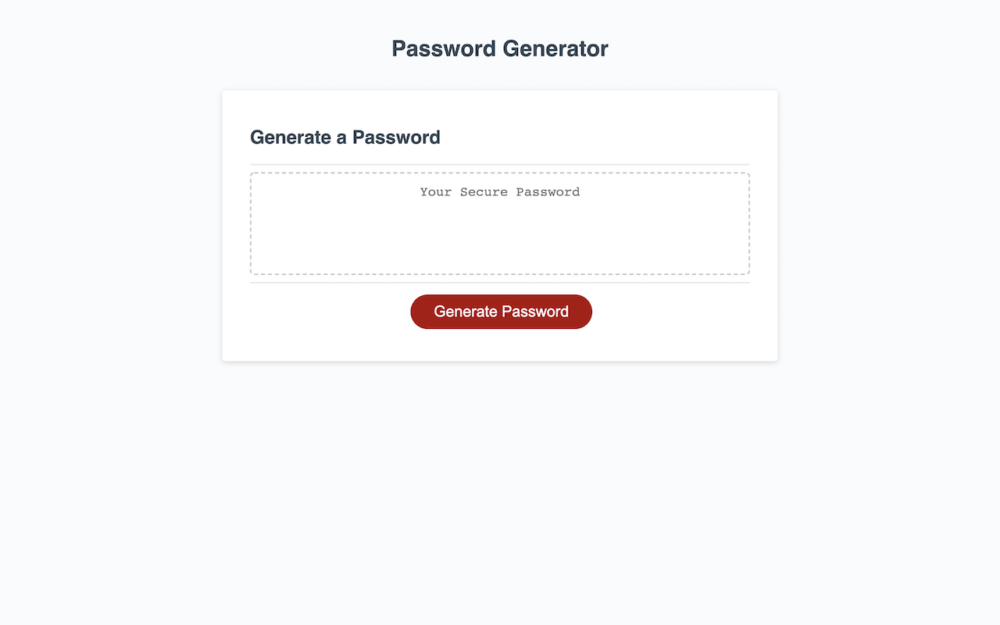
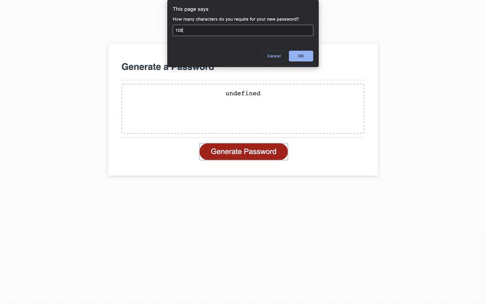
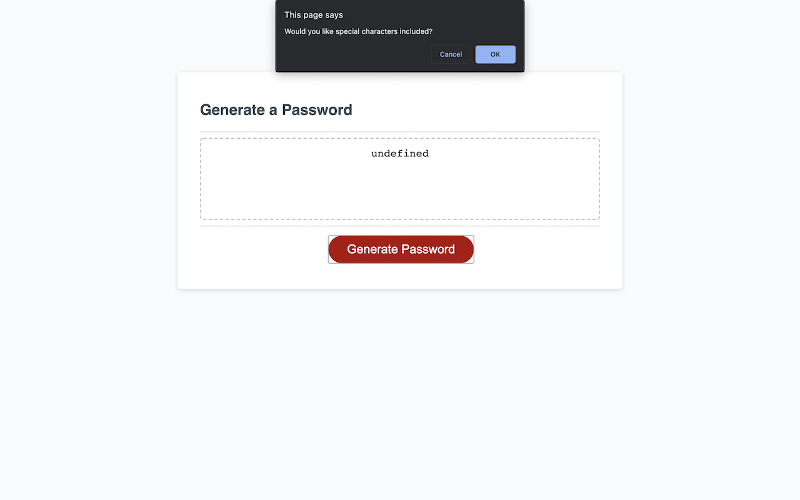
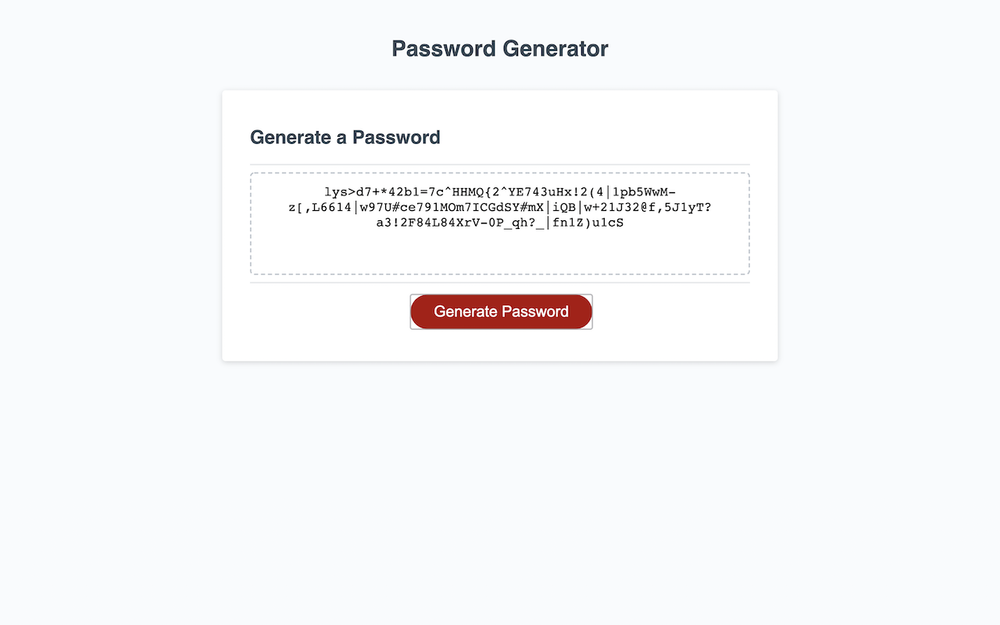

# Password Generator

## Deployment
The final deployed code can be found at:
[https://mrsamlaw.github.io/PWGenerator/](https://mrsamlaw.github.io/PWGenerator/)

## Technologies
- HTML
- CSS
- JavaScript

## Description
Our client has requested an application that enables employees to generate random passwords based on criteria that they’ve selected. This app will run in the browser and will feature dynamically updated HTML and CSS powered by JavaScript code that you write. It will have a clean and polished, responsive user interface that adapts to multiple screen sizes.

### Input Criteria 
Password generator must allow for the following criteria:
1. Length of between 8 and 128 characters long.
2. Use of lowercase characters
3. Use of Uppercase characters
4. Use of numbers
5. Use of [special characters](https://www.owasp.org/index.php/Password_special_characters)

### Screenshots

Password length prompt

Special characters confirmation

Final output of a 128 character password

### Psuedo code
- Prompt user for password length
- Password length validation - not a string & within number range
- Set password length
- Prompt user to confirm if lowercase characters to be included
- Store choice
- Prompt user to confirm if uppercase characters to be included
- Store choice
- Prompt user to confirm if numerals to be included
- Store choice
- Prompt user to confirm if special characters to be included
- Store choice
- Validation that all are not false
- Generate password based on criteria [**Loop**]
    - choose a random character type
    - if *x* character then choose random character
    - append to password until password is required length
- Output password
